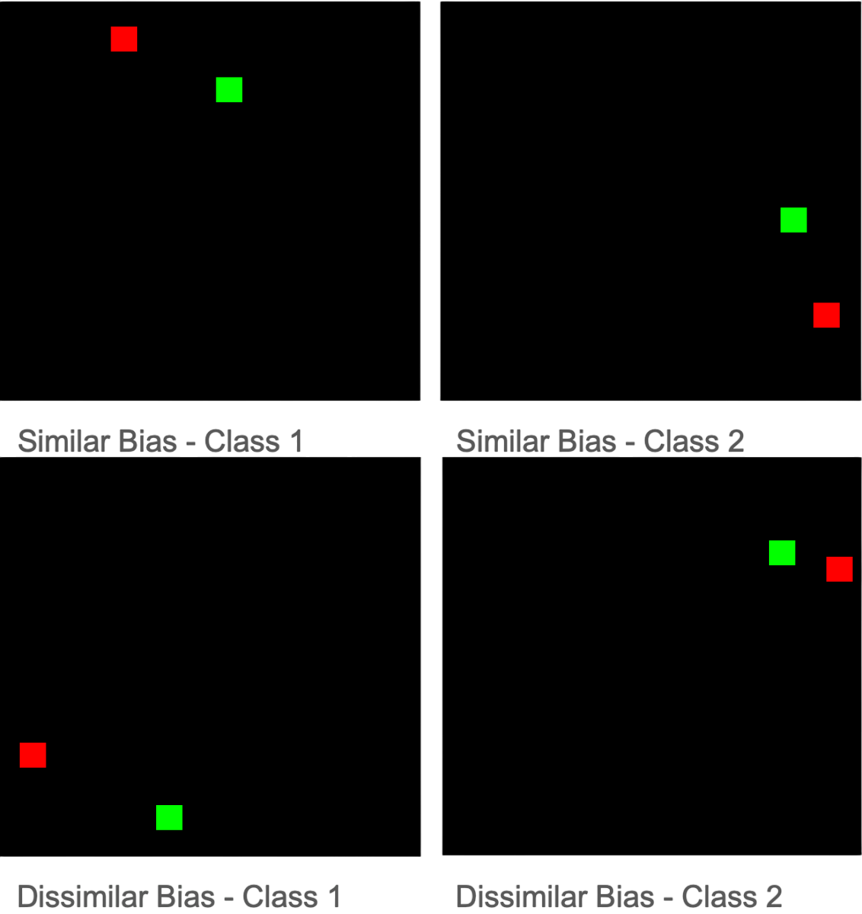

# Are CNNs Really Translation-Invariant? - A Controlled Dataset 
> Author: Alexandru Preda
## Problem Statement

Convolutional neural networks (CNNs) are often assumed to be
translation-invariant. This means that a CNN should recognize an object
regardless of where it appears in the image. In theory, convolutional
layers are translation-equivariant (shifting the input shifts the output
similarly). When combined with a global pooling layer (e.g. global
average or max pooling), the network should become translation-invariant
[@Azulay2018; @Kayhan_2020_CVPR]. However, recent research has
challenged this common assumption and shown that standard CNN
architectures can in fact exploit absolute position information in
images [@Kayhan_2020_CVPR]. For example, Kayhan et al. demonstrated that
a simple CNN could perfectly classify whether a patch was placed at the
top-left or bottom-right of an image, despite using convolution and
global pooling [@Kayhan_2020_CVPR]. This surprising result indicates
that CNNs with typical settings (such as zero-padding at image borders)
are not fully translation-invariant. In practice, this means a CNN might
treat the presence of an object near the edge differently than if the
same object is in the center, therefore knowing where in the image it
is.

If a dataset contains systematic location biases (for instance, certain
classes or features always appearing in one region of the image), a
conventional CNN may inadvertently learn those absolute position cues
instead of truly learning position-independent features. This becomes a
problem for generalization: the model might perform well on images where
the content appears in the familiar locations, but it could fail when
that content moves to a new position. These behavior underscores that
CNNs are not inherently invariant to translations in the way we expect.
Recognizing this issue is important, because many real-world tasks
demand that a vision model that is robust to object translation. We want
a car detector to find a car anywhere in an image, for instance, not
just in the position it was seen during training.

## Motivation

Translation invariance is a fundamental principle often credited for the
success of CNNs. The idea that a learned pattern (feature) can be
recognized regardless of location is supposed to give CNNs a built-in
advantage, reducing the need to see the exact same object in every
possible position during training. By conducting a controlled experiment
on translation invariance, we gain insight into how robust our models
are to distribution shifts involving spatial location. If a CNN is
heavily using position-specific features, it might excel on a training
dataset (or test data drawn from a similar distribution) but then
underperform on new data where the positions differ. Exposing this
vulnerability allows us to quantify the model's over-reliance on
location. Moreover, demonstrating the extent of this problem can
motivate improvements in model design and training. For instance,
awareness of translation variance has inspired architectural fixes such
as anti-aliasing filters (e.g. the BlurPool method) that improve
shift-invariance [@Zhang2019].

## Design of the Controlled Dataset

To investigate translation invariance, we design a synthetic "Red-Green"
dataset that allows us to precisely control and
alter the spatial distribution of features. The task is a binary image
classification where the label depends only on the relative arrangement
of two colored squares in each image, not their absolute positions. By
construction, if a model were perfectly translation-invariant, it would
be able to learn this task and generalize it to any positions of the
squares. Conversely, if the model is exploiting absolute position cues,
we can catch it by introducing and then flipping a position bias between
training and testing.\
Dataset Construction: Each image in the dataset contains two colored
blocks (one red, one green) on a black background. The two squares are
of equal size 32 X 32 squares on a
512 X 512 image. The two squares are placed at
random horizontal positions with one square to the left of the other.
The class label is determined by the left-right order of colors:

- **Class 1:** Red square on the left and green square on the right.

- **Class 2:** Green square on the left and red square on the right.

In a completely unbiased scenario, any pair of positions would do as
long as the left-right relationship is maintained. We could generate
such unbiased data easily (by placing the pair of squares at random
locations for each image). However, to test the CNN's ability to ignore
absolute location, we intentionally introduce a location bias in the
training data. Specifically, we constrain the vertical placement of the
squares such that each class predominantly appears in a different region
of the image.\
Therefore, we create the following subsets of data:

- **Training Set:**

  - All Class 1 examples are placed in the upper half of the image.

  - All Class 2 examples are placed in the lower half.

  - This spatial arrangement may allow the network to exploit upper vs.
    lower position as a shortcut, even though the true distinguishing
    pattern is the left-right color order.

  - A total of 2000 training images are generated, with 1000 per class.

  - The exact coordinates of the colored squares are randomized within
    the designated half-region to introduce variability.

- **Validation Set:**

  - All Class 1 examples are placed in the upper half of the image.

  - All Class 2 examples are placed in the lower half.

  - 1000 images are generated (500 per class) using the same positional
    bias as the training data.

  - This set is used to monitor training progress and verify model fit.

  - Since it shares the same distribution as the training data, a
    well-fitted model should perform similarly on both.

- **Test Sets:**

  - Two separate test sets of 1000 images each are prepared:

    1.  **Similar-Bias Test Set:**

        - Drawn from the same distribution as the training data.

        - Measures the model's ability to learn and reproduce training
          patterns.

    2.  **Dissimilar-Bias (Swapped) Test Set:**

        - Positional bias is inverted: Class 1 examples appear in the
          bottom half, Class 2 in the top half.

        - All other generation parameters remain unchanged.

        - This set evaluates the model's generalization to a new spatial
          context.

        - If the model truly learned the relative color order, it should
          still classify correctly. If it instead learned to rely on the
          vertical position cue, it will now be confused, since that cue
          correlates with the opposite class in this test set.

*Figure 1: Examples for each class and split*

All images across the dataset were synthetically generated via a Python
script. The script along with the dataset are available on
[here](https://github.com/AsthenicDog390/control_dataset). This ensures
the only differences between images are the positions and colors of the
squares, there are no other distracting features. We want to highlight
that the script ensures that no configuration of an image can repeat
itself. Figure 1 illustrates example images from each
class and each split. Therefore, an ideal translation-invariant
classifier can succeed by focusing solely on the relative arrangement of
the red and green squares.

## Scientific Method and Experimentation

Our approach follows the scientific method by first positing a
hypothesis and then designing a controlled experiment to test it. The
hypothesis is: **Standard CNNs with zero-padding aren't fully
translation-invariant**. If the training data has a location bias, the
network may leverage that bias instead of learning the intended relative
pattern. To test this, we crafted the Red-Green dataset as described,
where we can deliberately flip the bias in a controlled way. The
experimental procedure is straightforward: train a CNN on the biased
training set, then evaluate it on both the similar-biased test set and
the swapped unbiased test set. By comparing the performance on these two
test sets, we can directly observe whether the network had been encoding
the absolute positions.

This is a form of controlled experiment because we have isolated the
variable of interest, namely the absolute vertical position of the
pattern, while keeping everything else constant. Both test sets contain
the exact same kinds of objects (red and green squares) and the same
relative arrangement patterns. They differ only in whether the absolute
position matches what the model saw during training. Therefore, any drop
in accuracy from the similar test to the dissimilar test can be
attributed to the change in absolute spatial location of the squares. In
an ideal, translation-invariant model, we would expect no significant
difference in accuracy between the two test sets, since the underlying
task (distinguishing left-right order) is the same. In a model that has
learned or exploited the positional bias, however, we expect to see a
sharp decrease in accuracy on the dissimilar test set. In fact, if a
model completely relies on the top vs. bottom cue, it would misclassify
almost every swapped-position image in the dissimilar test.

The dataset is designed to be reliable. By controlling everything except
the position of the squares, we can clearly see how much the model
depends on where things appear. The images are generated with a script,
so the process is consistent and repeatable. The sizes of the sets can
easily be adjusted through variables such that we can scale it according
to individual needs.

Therefore, the dataset is reliable and achieves the stated objective: we
want to test whether a CNN is truly translation-invariant or if it
exploits absolute spatial location.

## References

[@Kayhan2020]: Kayhan, O. S., & van Gemert, J. C. (2020). *On Translation Invariance in CNNs: Convolutional Layers Can Exploit Absolute Spatial Location*. In *Proceedings of the IEEE/CVF Conference on Computer Vision and Pattern Recognition (CVPR)*, 14274–14285.

[@Azulay2018]: Azulay, A., & Weiss, Y. (2018). *Why do deep convolutional networks generalize so poorly to small image transformations?* arXiv preprint arXiv:1805.12177.

[@Zhang2019]: Zhang, R. (2019). *Making Convolutional Networks Shift-Invariant Again*. In *Proceedings of the 36th International Conference on Machine Learning (ICML)*, 97, Proceedings of Machine Learning Research, 7324–7334.

[@control_dataset_repo]: Preda, A. (2025). *Control Dataset for Testing Translation Invariance*. Retrieved from [https://github.com/AsthenicDog390/control_dataset](https://github.com/AsthenicDog390/control_dataset)